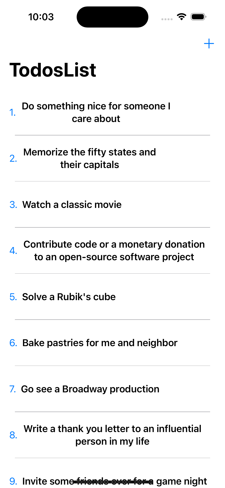
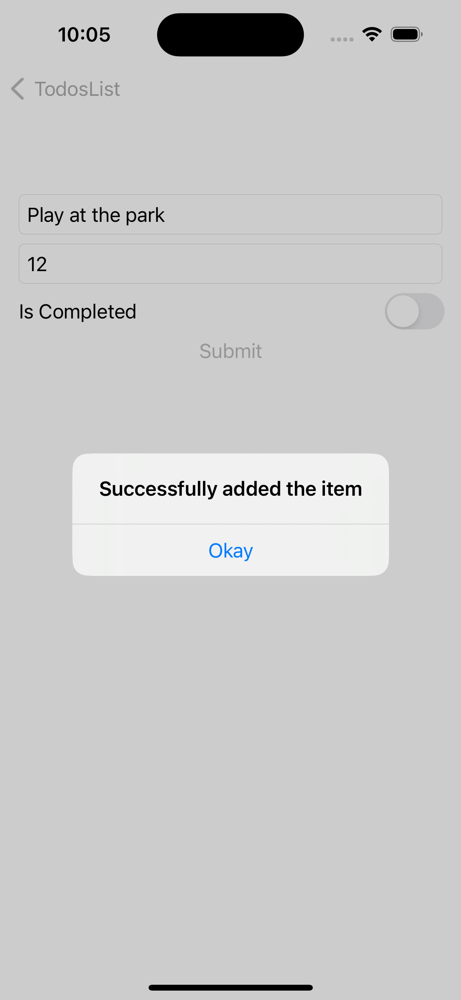
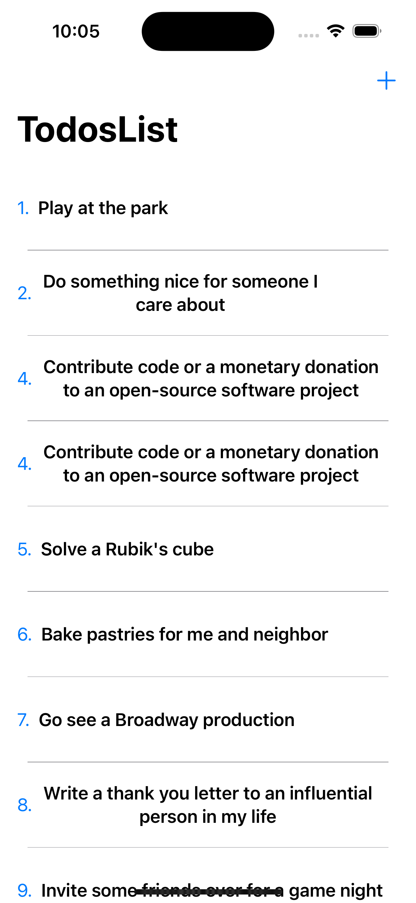
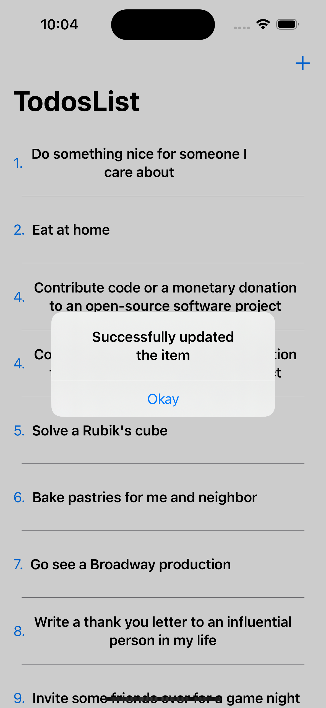
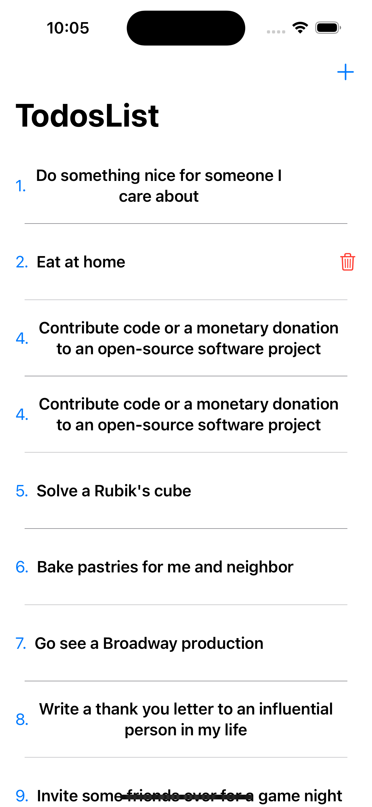
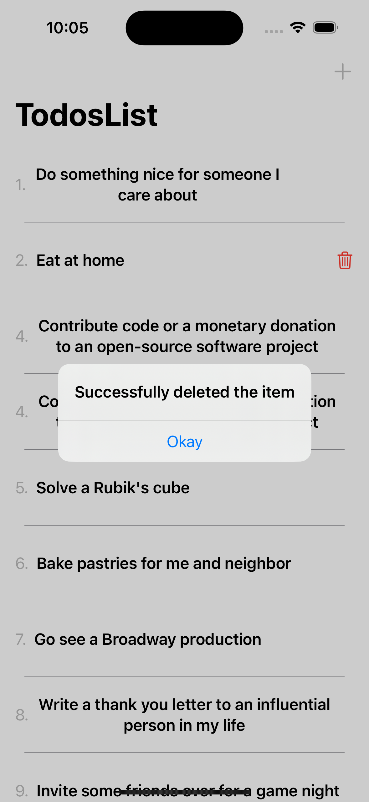

# TodoApp

### Project description

- This is a todo list app developed using SwiftUI and [dummyjson todo API](https://dummyjson.com/todos).

### Fetching the existing Todo list from API endpoints 

- Read feature ["GET"] : Able to read list of todo items from API endpoints.  API endpoint gives always the same data.

- Create List feature ["POST"]: Able to add a new todo item in the existing list of todo items. Api is giving success but it doesnot give that newly added item next time. So, had manually appended the newly added iteminto existing list.

- Update feature ["PUT"] : Able to update the existing item using PUT requests.

- Delete feature ["DELETE"]: Able to delete the existing item using DELETE requests.
  
### Steps to run

- Goto github link [Planets APP](https://github.com/keshgurung/TodoApp)
- Open terminal, select a place to clone the project eg: cd desktop
- Use command ``` git clone https://github.com/keshgurung/TodoApp ``` to clone the project locally.
- Open the project, CLick on the TodoApp.xcodeproj file. The file will open in XCode.
- Goto product menu and select run or simply click on the play button to run the app in simulator.
- To run tests, goto product menu and click on test. All the tests will run on the simulator.

### XCode

- Version: 14.3
- Minimum Deployment: iOS 16.0 and over

### Architecture and design pattern:

- The app follows Repository Clean Architecture, with dependency injection pattern, singleton design pattern. 

### Testcases

- All the unit test cases are written using XCTest framework (native iOS).
- Mock and stub technique is used writing the unit test cases in the app to test the network service as well as the view model tests.

### Screenshots

- Todos list screen


- Add todo list



- Update todo list


- Delete todo list



